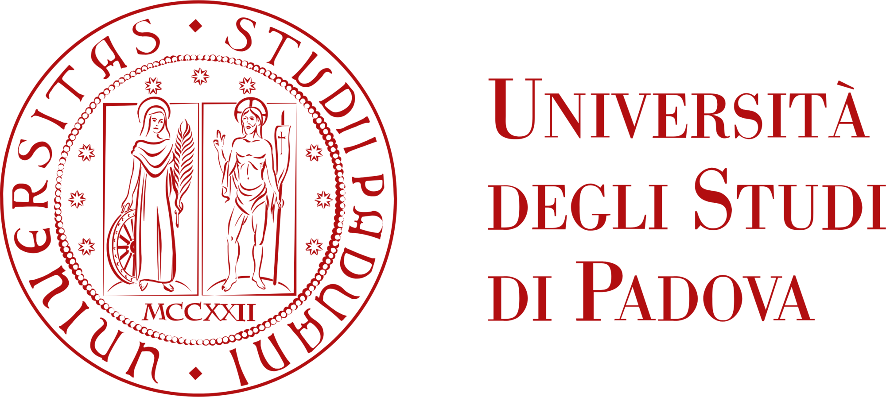
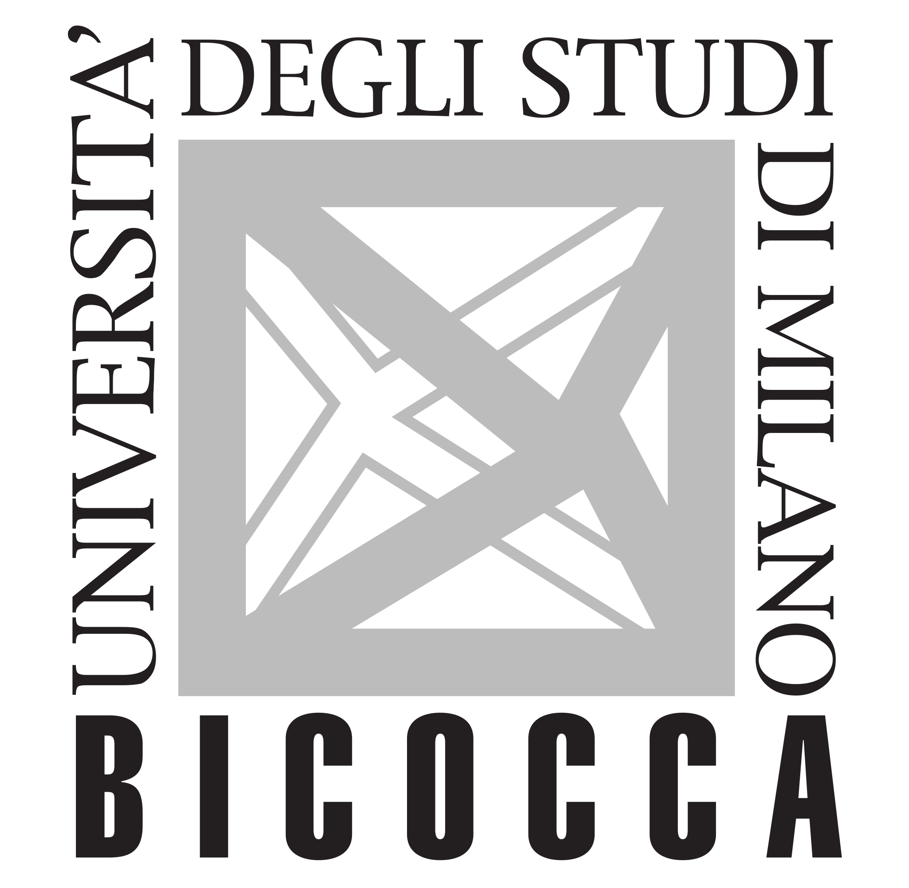

[Curriculum vitae](files/cv_esteralongi.pdf){.btn .btn-outline-primary .btn role="button" data-toggle="tooltip" title="CV"}

### Current position {.central}

:::::: {layout="[12, 0, 88]"}
::: {#second-column}

:::
::: {#middle-column}
:::
::: {#first-column}
[University of Padova]{.blue}, Department of Statistical Sciences, Padova, Italy.

-   Ph.D. Candidate in Statistical Sciences. *November 2024 -- current*
-   Supervisor: [Gianmarco Altoè](https://www.dpss.unipd.it/en/gianmarco-altoe)

In cv.qmd nella sezione Current position:
:::
::::::

:::::: {layout="[12, 0, 88]"}
::: {#second-column}

:::
::: {#middle-column}
:::
::: {#first-column}
[Harvard T.H. Chan School of Public Health]{.harvardred}, Department of Biostatistics, Boston, MA, U.S.A.

-   Visiting PhD student. *September 2025 -- current*
-   Supervisor: [Giovanni Parmigiani](https://www.hsph.harvard.edu/profile/giovanni-parmigiani/)
-   Also visiting at the Department of Data Sciences, Dana-Farber Cancer Institute.
:::
::::::

---

### Education {.central}

:::::: {layout="[12, 0, 88]"}
::: {#second-column}

:::
::: {#middle-column}
:::
::: {#first-column}
[University of Padova]{.blue}, Department of Statistical Sciences, Padova, Italy.

-   Master's degree in Statistical Sciences. *September 2022 -- September 2024*
-   Graduation grade: 110/110 with honors
-   Thesis: *Surveillance of fraudulent activities via dynamic networks*
-   Supervisor: [Bruno Scarpa](https://homes.stat.unipd.it/brunoscarpa/)
:::
::::::

:::::: {layout="[12, 0, 88]"}
::: {#second-column}

:::
::: {#middle-column}
:::
::: {#first-column}
[University of Milano-Bicocca]{.blue}, Milan, Italy.

-   Bachelor's degree in Statistical and Economic Sciences. *October 2019 -- September 2022*
-   Graduation grade: 110/110 with honors
-   Thesis: *Classification and similarity analysis of occupations: the case of Bicocca degree courses*
-   Supervisor: [Mario Mezzanzanica](https://www.unimib.it/mario-mezzanzanica)
:::
::::::

---

### Teaching {.central}

-   \[[Spring 2025]{.blue}\] — Teaching assistant, *Strumenti statistici per l'analisi di dati aziendali* (graduate). Instructor: Prof.ssa Mariangela Guidolin. University of Padova.

---

### Awards {.central}

-   \[[2022]{.blue}\]: Study Excellence Award — scholarship awarded to meritorious students enrolled in the first year of the M.Sc. in Statistical Sciences, University of Padova.

---

### Service to the university {.central}

**University of Padova**

-   Member of the Departmental Council in Statistical Sciences for Ph.D. Students and Research Fellows. *March 2025 -- present*
-   Member of the Departmental Council, Course Council and Student Council in Statistical Sciences. *January 2023 -- September 2024*

**University of Milano-Bicocca**

-   Student Representative, Board of Directors. *January 2022 -- September 2022*
-   Member of the Departmental and Course Council, Joint Committee in the Department of Economics, Quantitative Methods and Business Strategies. *January 2019 -- September 2022*

---

### Skills {.central}

-   **Programming:** R, Stan, Python, LaTeX
-   **Languages:** Italian (native), English