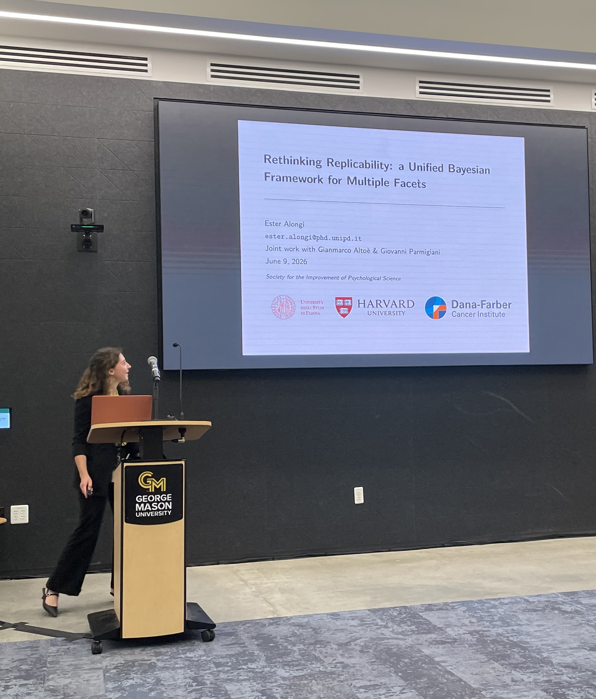
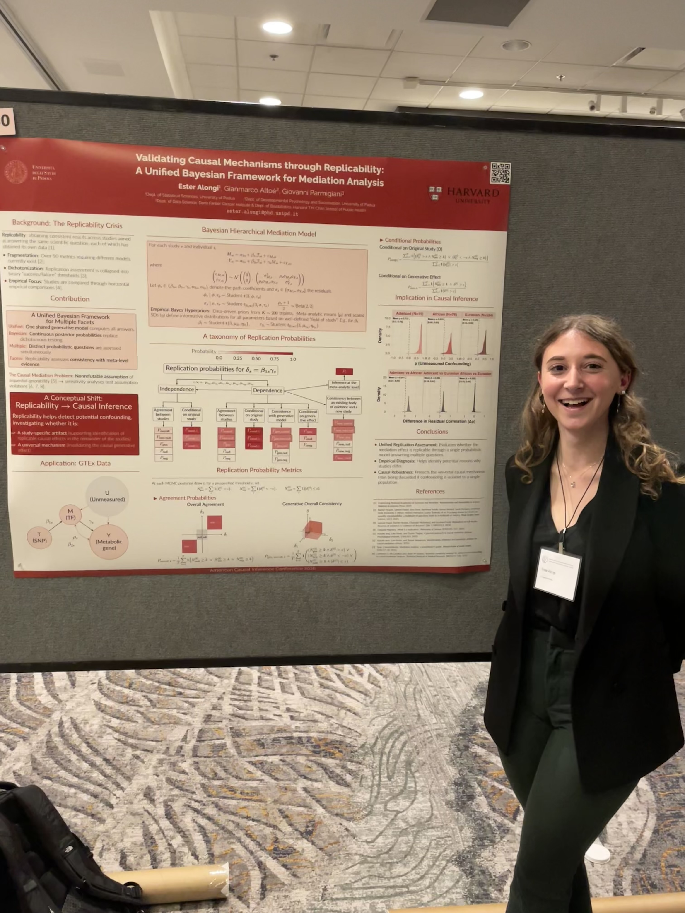

## Talks and Presentations {.central}

[2026]{.blue}

-   **JSM 2026**, Boston, MA — *Multi-Study Mediation Analysis: Identifiability, Replicability, and Unmeasured Confounding* — [Contributed talk]{.gyellow}

:::::: {layout="[35, 65]"}
::: {}

:::
::: {}
**SIPS 2026**, Washington D.C. — *Rethinking Replicability: a Unified Bayesian Framework for Multiple Facets* — [Contributed talk]{.gyellow}
:::
::::::

-   **Psicostat**, Padova, Italy — *Rethinking Replicability: a Unified Bayesian Framework for Multiple Facets* — [Contributed talk]{.gyellow}

:::::: {layout="[35, 65]"}
::: {}

:::
::: {}
**ACIC 2026**, Salt Lake City, UT — *Validating Causal Mechanisms through Replicability: A Unified Bayesian Framework for Mediation Analysis* — [Poster]{.ggreen}
:::
::::::

[2025]{.blue}

-   **SIS 2025**, Genova, Italy — *Surveillance of fraudulent activities through dynamic networks* — [Contributed talk]{.gyellow}